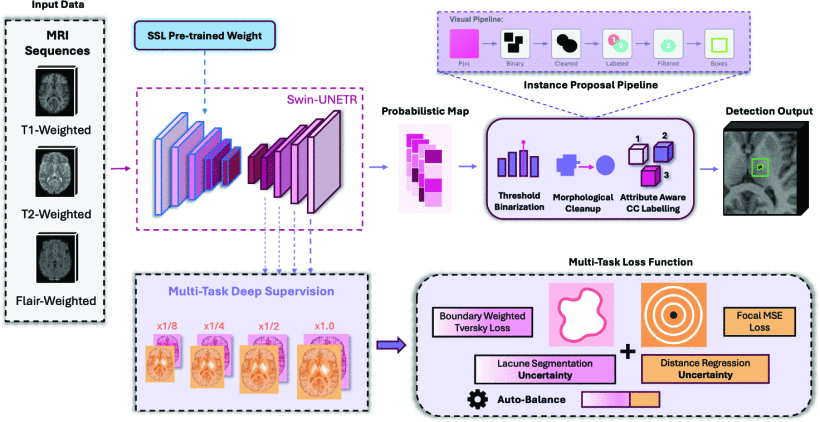

# Swin-DS: A Deeply Supervised Transformer with Geometric Guidance for Robust Lacune Detection

[](https://ieeexplore.ieee.org/abstract/document/11461885)

**Training, inference, and evaluation code for Swin-DS accepted by ICASSP 2026.**



---

## Overview

Swin-DS is a deeply supervised Swin Transformer architecture with geometric guidance (distance map supervision) designed for robust lacune segmentation in brain MRI. The model processes multi-modal inputs (FLAIR, T1, T2) and produces voxel-level lacune segmentation masks.

**Key Features:**
- Swin Transformer backbone with deep supervision
- Geometric guidance via distance map auxiliary loss
- Candidate generator for efficient lacune detection
- 5-fold cross-validation training pipeline
- Sliding-window inference with automatic preprocessing

---

## Setup

Create a fresh Python environment, then install the dependencies:

```bash
pip install -r requirements.txt
```

For GPU training, install the PyTorch build that matches your CUDA driver before installing the remaining dependencies. The original experiments used PyTorch 2.6 and MONAI 1.5.

## Project Structure

```text
Swin-DS-Lacune-Detection-ICASSP-2026/
├── inference/
│   ├── predict_subject.py                # Single-subject inference CLI
│   └── evaluate_experiment_a.py          # 5-fold cross-validation evaluation
├── training/
│   ├── train_baseline.py                 # Baseline Swin-UNETR (no DS, no DM)
│   ├── train_candidate_generator_cv.py   # Candidate generator training
│   ├── train_distance_map_cv.py          # Distance map supervision training
│   └── train_deep_supervision_cv.py      # Full deep supervision training
├── Swin-DS.gif
├── requirements.txt
└── README.md
```

## Usage

### Inference

Run a trained checkpoint on a single subject:

```bash
python inference/predict_subject.py \
  --flair /path/to/sub-001_space-T1_desc-masked_FLAIR.nii.gz \
  --t1 /path/to/sub-001_space-T1_desc-masked_T1.nii.gz \
  --t2 /path/to/sub-001_space-T1_desc-masked_T2.nii.gz \
  --checkpoint "Model Weight/A4b Deep Supervision (DM)/fold1_best.pth" \
  --output outputs/sub-001_lacune_mask.nii.gz
```

The CLI automatically handles standard and deep-supervision checkpoints. Inputs are reoriented to RAS, resampled to 1 mm isotropic spacing, intensity-normalized, and processed with sliding-window inference. The output mask is saved as a NIfTI file in the preprocessed RAS 1 mm space.

### Training

Run one experiment script at a time:

```bash
# Baseline Swin-UNETR (Experiment A1)
python training/train_baseline.py

# Candidate generator
python training/train_candidate_generator_cv.py

# Distance map supervision
python training/train_distance_map_cv.py

# Full deep supervision (Swin-DS)
python training/train_deep_supervision_cv.py
```

Each script performs 5-fold stratified cross-validation and writes checkpoints under `LACUNE_PROJECT_PATH/Model Weights/`.

Configure paths and training parameters with environment variables:

```bash
export LACUNE_DATA_ROOT=/path/to/Task3
export LACUNE_PROJECT_PATH=/path/to/project/root
export LACUNE_MAX_EPOCHS=200           # optional
export LACUNE_MAX_FOLDS=5              # optional: run fewer folds
```

### Evaluation

Evaluate the released Experiment A variants:

```bash
python inference/evaluate_experiment_a.py
```

The evaluation script expects fold checkpoints named `fold1_best.pth`, `fold2_best.pth`, etc. under the variant directories configured in the script.

## Citation

```bibtex
@inproceedings{li2026swinds,
  title={Swin-DS: A Deeply Supervised Transformer with Geometric Guidance for Robust Lacune Detection},
  author={Li, Krinos and others},
  booktitle={IEEE International Conference on Acoustics, Speech and Signal Processing (ICASSP)},
  year={2026},
  organization={IEEE}
}
```

## License

Please refer to the repository for licensing information.
